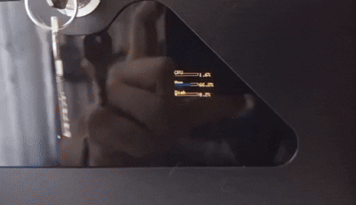
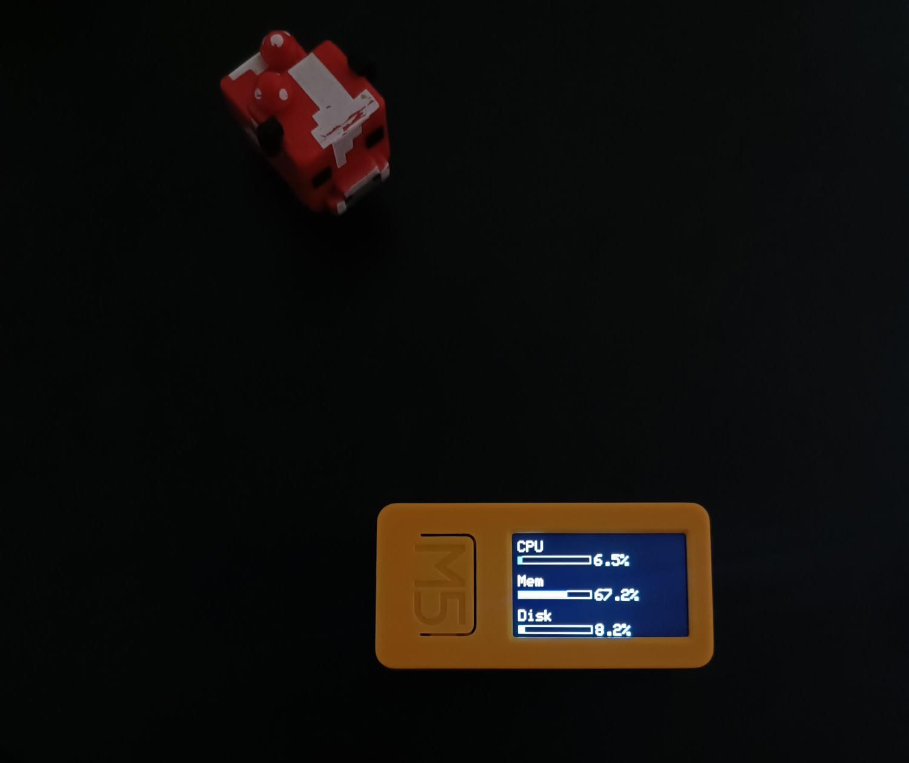

# M5 Stick With Proxmox Metrics
This is an simple app to display CPU, Memory and root disk usage from Proxmox on m5 stick.

Ps: I wasn't using the device, so I decided to give it a use.

## How it works?
Theres 2 apps to make this work, the [Python](main.py) one and [C++](m5-firmware/main.cpp) one. The python app get the metrics from Proxmox api and the C++ get the results from python app and display on the screen.

## How to setup?
- First you need to start the python app, you can use the [docker compose](docker-compose.yaml) file. Do not forget to change the environment variables.
  - If you know python and do not want to use docker, you can read the code and run the python file easily.
- Then you have to change Wi-Fi and python app url variables on [main.cpp](m5-firmware/main.cpp). This works with http, for https, do not use self signed certificates.
- Now use your favorite tool to burn the c++ code on your m5 stick. I'm using arduino IDE and m5 stick plus2.
- Now should work (I hope so). The code is very simple so anyone can fix any problem 🙂.

## Enviroment variables (for [python](main.py) app)

| Key          | Example            |
| ------------ | ------------------ |
| PROXMOX_HOST | 192.168.1.200      |
| PROXMOX_PORT | 8006               |
| USERNAME     | serviceaccount@pam |
| PASSWORD     | s3Cur3!P@$$w0rd    |
| NODE_NAME    | proxmox            |
| LOG_LEVEL    | DEBUG              |

## Final result

